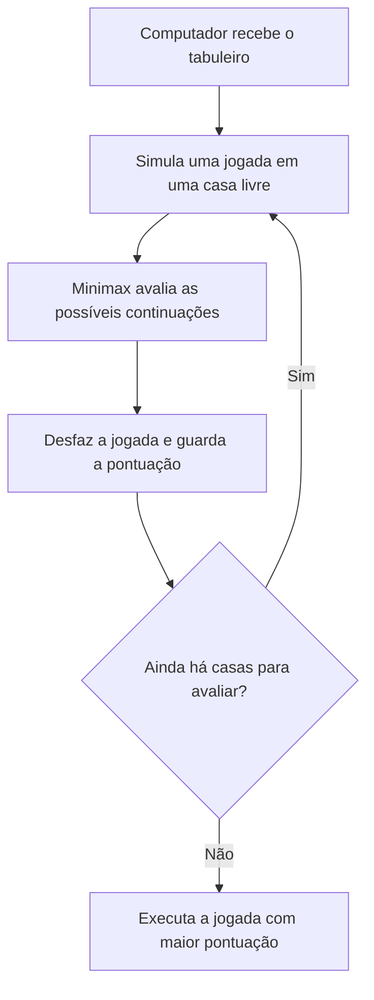

# Jogo da Velha com Minimax

Jogo da velha desenvolvido em **C**, executado no terminal, com um adversário computacional que utiliza o algoritmo **Minimax** para escolher suas jogadas.

O projeto aplica matrizes, recursão, busca em árvore e verificação das regras do jogo.

## Funcionalidades

- Jogador humano (`X`) contra computador (`O`).
- Sorteio de quem inicia cada partida.
- Verificação de vitória e empate.
- Validação de casas ocupadas e posições fora do tabuleiro.
- Reinício da partida com o comando `R`.
- Menu para iniciar partidas ou sair.
- Teste exaustivo das sequências de jogadas humanas contra a estratégia do computador.

## Como executar

É necessário ter um compilador C, como o GCC.

Na pasta principal do projeto, compile:

```bash
gcc -std=c11 -Wall -Wextra -pedantic jogo_da_velha.c -o jogo
```

Execute no Linux ou macOS:

```bash
./jogo
```

No Windows, o executável pode ser iniciado com:

```powershell
.\jogo.exe
```

## Como jogar

1. Digite `1` no menu para iniciar.
2. Na sua vez, informe linha e coluna, de **1 a 3**, separadas por espaço.
3. Por exemplo, `2 3` seleciona a segunda linha e a terceira coluna.
4. Digite `R` na sua vez para reiniciar.
5. Ao terminar, escolha entre uma nova partida e o retorno ao menu.

## Como funciona o Minimax

Para cada casa disponível, o computador simula uma jogada e avalia recursivamente as possíveis continuações até encontrar uma vitória, derrota ou empate.

Durante a busca:

- O computador escolhe os resultados com maior pontuação.
- O jogador humano é considerado um adversário que escolhe os resultados com menor pontuação para o computador.
- Cada jogada simulada é desfeita antes de avaliar a próxima possibilidade.

A pontuação é calculada do ponto de vista do computador:

| Resultado | Pontuação |
|---|---|
| Vitória do computador | `10 - profundidade` |
| Vitória do jogador | `profundidade - 10` |
| Empate | `0` |

A profundidade faz o algoritmo preferir vitórias mais rápidas e, em posições de derrota inevitável, adiá-las.

Com a implementação correta, o computador não perde: contra um jogador que também faz as melhores escolhas, a partida termina em empate.

## Fluxo de escolha da jogada



## Decisões de implementação

### Busca completa

O tabuleiro 3 × 3 permite avaliar todas as continuações de uma posição sem utilizar uma função heurística para estados intermediários.

### Desempate entre jogadas

Quando duas jogadas têm a mesma pontuação, o computador mantém a primeira encontrada na ordem de leitura do tabuleiro. Por isso, sua escolha é determinística.

### Organização do código

As funções separam o fluxo da partida, a manipulação do tabuleiro, a leitura de entradas e a seleção de jogadas pelo Minimax.

## Teste exaustivo

O arquivo `testes/teste_exaustivo.c` explora todas as sequências válidas de jogadas humanas contra as escolhas determinísticas do computador.

São considerados dois cenários:

- O jogador humano começa.
- O computador começa.

Compile e execute a partir da pasta principal:

```bash
gcc -std=c11 -Wall -Wextra -pedantic testes/teste_exaustivo.c -o teste
./teste
```

No Windows, execute com `.\teste.exe`.

O teste informa a quantidade de partidas exploradas e as derrotas do computador em cada cenário. O resultado esperado é **zero derrotas nos dois cenários**.

O programa retorna `0` se não houver derrotas e um valor diferente de zero se detectar alguma.

Esse teste verifica a estratégia de jogo. Ele não cobre a interação com o menu nem a leitura das entradas no terminal.

## Estrutura do projeto

```text
.
├── jogo_da_velha.c
├── testes/
│   └── teste_exaustivo.c
├── .gitignore
└── README.md
```

## Próximas melhorias

- Tornar a validação de entradas numéricas mais rigorosa.
- Adicionar testes específicos para as regras e a entrada de dados.
- Implementar poda alfa-beta para reduzir a busca.
- Adicionar níveis de dificuldade.

## Autor

**Lucas Costa**

- [GitHub](https://github.com/lucascostars)
- [LinkedIn](https://www.linkedin.com/in/lucascostars)
